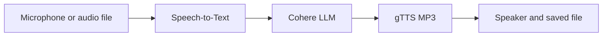

# Voice-to-Voice AI Assistant

**Prepared by / إعداد الطالب:** **ناصر ممدوح الشريف**  
**English name:** **Nasser Mamdouh Alshareef**

This project implements a complete voice-to-voice assistant with the three
required stages:

1. **Speech-to-Text (STT):** capture speech from a microphone or audio file and
   convert it to written text.
2. **LLM Processing:** send the text to Cohere Chat API v2 and generate a useful
   response.
3. **Text-to-Speech (TTS):** convert the response to an MP3 file and play it.

The project also includes typed-text mode, audio-file mode, Arabic/English
configuration, clear error messages, and automated tests that do not require a
microphone or API key.

## Required-task coverage

| Requirement | Implementation |
| --- | --- |
| Convert audio input to text | `GoogleSpeechToText` in `voice_assistant/stt.py` |
| Generate a response using an LLM | `CohereChatModel` in `voice_assistant/llm.py` |
| Convert the response to audio | `GoogleTextToSpeech` in `voice_assistant/tts.py` |
| Explain all steps | This README documents setup, flow, commands, and troubleshooting |

## Architecture



## Project structure

```text
.
├── main.py
├── voice_assistant/
│   ├── __init__.py
│   ├── assistant.py
│   ├── config.py
│   ├── errors.py
│   ├── llm.py
│   ├── stt.py
│   └── tts.py
├── tests/
│   ├── test_assistant.py
│   ├── test_config.py
│   └── test_llm.py
├── examples/
│   └── sample_session.txt
├── config.example.env
├── environment.yml
├── requirements.txt
├── AUTHOR.txt
├── .gitignore
└── README.md
```

## Technologies

- Python 3.10 or newer
- SpeechRecognition and PyAudio for microphone input
- Google Speech Recognition for speech-to-text
- Cohere Chat API v2 for LLM responses
- gTTS for MP3 generation
- playsound3 for playback
- python-dotenv for safe environment configuration

## Installation option 1: Anaconda

Open **Anaconda Prompt** inside the project folder:

```bash
conda env create -f environment.yml
conda activate nasser-voice-assistant
```

## Installation option 2: Python virtual environment

```bash
python -m venv .venv
```

Windows:

```bash
.venv\Scripts\activate
python -m pip install -r requirements.txt
```

macOS or Linux:

```bash
source .venv/bin/activate
python -m pip install -r requirements.txt
```

PyAudio needs PortAudio. `environment.yml` installs it through conda. On Ubuntu,
if pip installation fails, install the system package first:

```bash
sudo apt update
sudo apt install portaudio19-dev python3-pyaudio
python -m pip install -r requirements.txt
```

## Cohere API configuration

1. Create a Cohere API key from the Cohere dashboard.
2. Copy `config.example.env` to a new file named `.env`.
3. Replace the placeholder key:

```env
COHERE_API_KEY=your_real_key_here
COHERE_MODEL=command-a-plus-05-2026
```

The `.env` file is ignored by Git, so the real key must never be uploaded to
GitHub.

## Run the complete microphone workflow

```bash
python main.py
```

The program calibrates the microphone, listens to one question, prints the
transcription, sends it to Cohere, creates
`output/assistant_response.mp3`, and plays the file.

## Test the setup with typed text

This still runs the LLM and TTS stages, but it does not require a microphone:

```bash
python main.py --text "What is artificial intelligence?"
```

Create the MP3 without playing it:

```bash
python main.py --text "Explain OpenCV briefly" --no-play
```

## Use a recorded audio file

SpeechRecognition supports PCM WAV, AIFF, and native FLAC input:

```bash
python main.py --audio-file question.wav
```

## Select a different microphone

List detected devices:

```bash
python main.py --list-microphones
```

Then set the selected number in `.env`:

```env
MICROPHONE_INDEX=1
```

## Arabic mode

Use these values in `.env`:

```env
SPEECH_LANGUAGE=ar-SA
TTS_LANGUAGE=ar
ASSISTANT_LANGUAGE=Arabic
```

English defaults are `en-US`, `en`, and `English`.

## How the code works

### 1. Speech-to-Text

`GoogleSpeechToText` opens the chosen microphone, measures ambient noise, and
records one phrase. `recognize_google` converts the recorded audio to text. The
same class can also read a supported audio file.

### 2. LLM response generation

`CohereChatModel` sends a `system` message plus the user text to Cohere Chat API
v2. It extracts the text content from the assistant message and retains a small,
bounded conversation history.

### 3. Text-to-Speech

`GoogleTextToSpeech` sends the response to gTTS and saves the returned MP3.
`PlaysoundAudioPlayer` then plays the saved response unless `--no-play` is used.

### 4. Error handling

Expected errors—missing API key, microphone timeout, unintelligible speech,
network failure, unsupported audio, and playback failure—are converted to clear
messages instead of raw tracebacks.

## Automated tests

The tests replace external services with controlled fake providers, so they
verify the complete orchestration without spending API credit or needing audio
hardware.

```bash
python -m unittest discover -s tests -v
```

Expected result:

```text
Ran 8 tests
OK
```

The live microphone/API/TTS workflow must also be run after adding a valid API
key because it depends on the user's microphone, internet connection, Cohere
account, and speakers.

## Troubleshooting

### `COHERE_API_KEY is missing`

Create `.env` from `config.example.env` and add a valid key.

### Microphone cannot open

- Allow microphone access for Terminal, Anaconda, or VS Code.
- Close other applications using the microphone.
- Run `python main.py --list-microphones` and set `MICROPHONE_INDEX`.
- Use the Anaconda installation if PyAudio fails under pip.

### Speech is not understood

- Confirm that `SPEECH_LANGUAGE` matches the spoken language.
- Speak after the calibration message in a quiet place.
- Increase `LISTEN_TIMEOUT` or `PHRASE_TIME_LIMIT` in `.env`.

### MP3 is created but not played

Open the MP3 manually from the `output` folder or use `--no-play`. The full TTS
stage has still completed when the MP3 exists.

### Cohere model is unavailable

Set `COHERE_MODEL` to a Chat API v2 model enabled for the current Cohere account.

## Security notes

- Never commit `.env` or a real API key.
- Revoke a key immediately if it is accidentally exposed.
- Only generated audio belongs in `output/`, which is ignored by Git.

## شرح مختصر بالعربي

المشروع يستقبل الكلام من الميكروفون ويحوّله إلى نص، ثم يرسل النص إلى نموذج
Cohere لتوليد الرد. بعد ذلك يحوّل الرد إلى ملف MP3 باستخدام gTTS ويشغّله.

خطوات التشغيل المختصرة:

```bash
conda env create -f environment.yml
conda activate nasser-voice-assistant
```

انسخ `config.example.env` إلى `.env`، وضع مفتاح Cohere، ثم شغّل:

```bash
python main.py
```

للتجربة من دون ميكروفون:

```bash
python main.py --text "ما هو الذكاء الاصطناعي؟" --no-play
```

